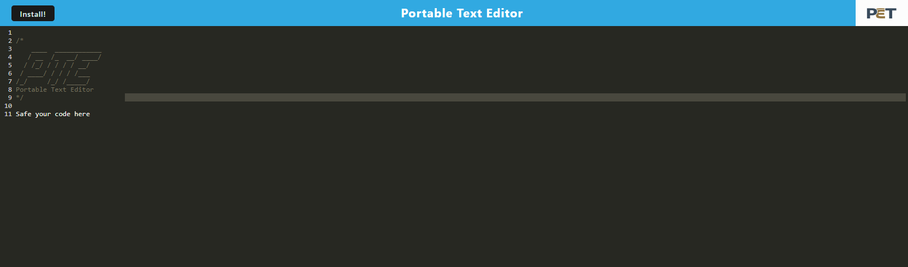

# Portable-Text-Editor

## Description

In this project I wanted to modifie existing code to add some functionalities like:
- to add IndexDB functionallity to store text inside IndexDB
- to be able to install web app to local machine
- to add listenner and routes for Service Worker

## Table of Contets

- [Screenshots](#screenshots)
- [Links](#links)

## Screenshots

In this section I provided screenshots of web application

## Links

In this section I added links to the Live Application  and to the GitHub repositories with the original  and modified codebase.

Live App:
    

Original GitHub Code Repository:
    https://github.com/coding-boot-camp/cautious-meme

Modified GitHub Code Repository:
    https://github.com/MykhailoZakh/Portable-Text-Editor